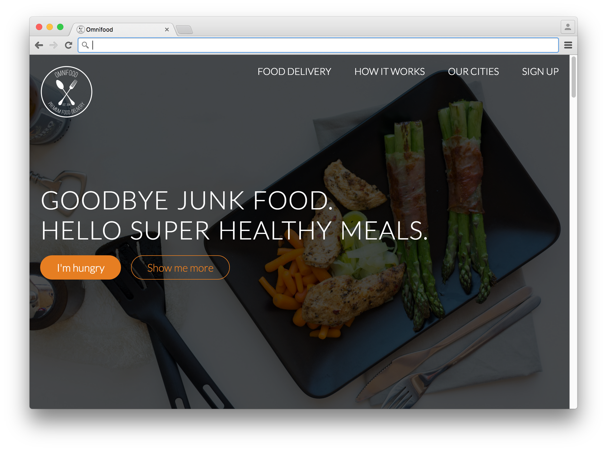
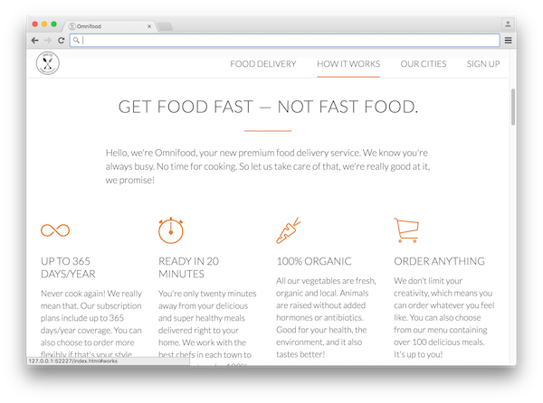
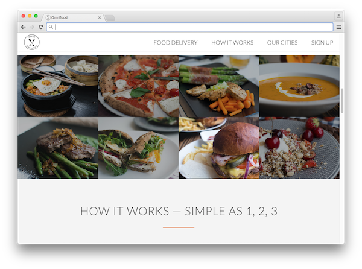
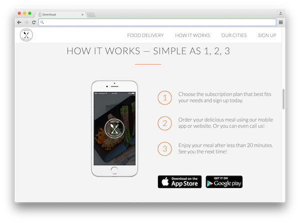
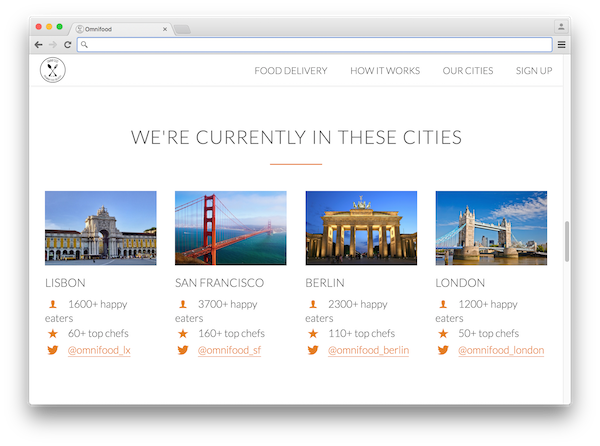
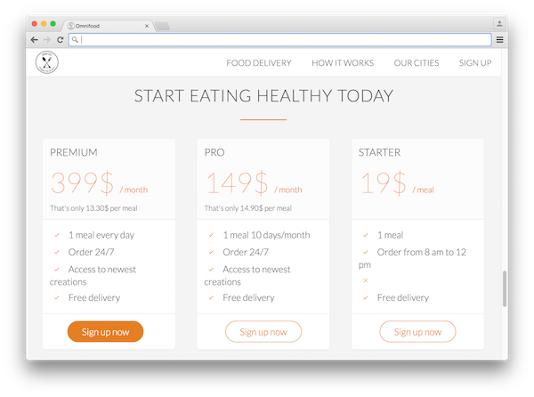
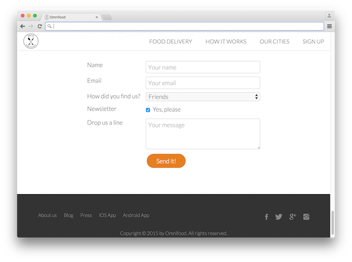

#Build Responsive Real World Websites with HTML5 and CSS3

##Link to Udemy course
https://www.udemy.com/design-and-develop-a-killer-website-with-html5-and-css3/learn/#/

In this course we built a site for the fictional company Omnifood. Applied are modern design and website fluid UI flexibility. Key features include animations, adjusting to app/window sizes down to phone size, and good design practices. 

All assets and content provided by course thru udemy.com.

##Screenshots:
 
 
 
 
 
 
 